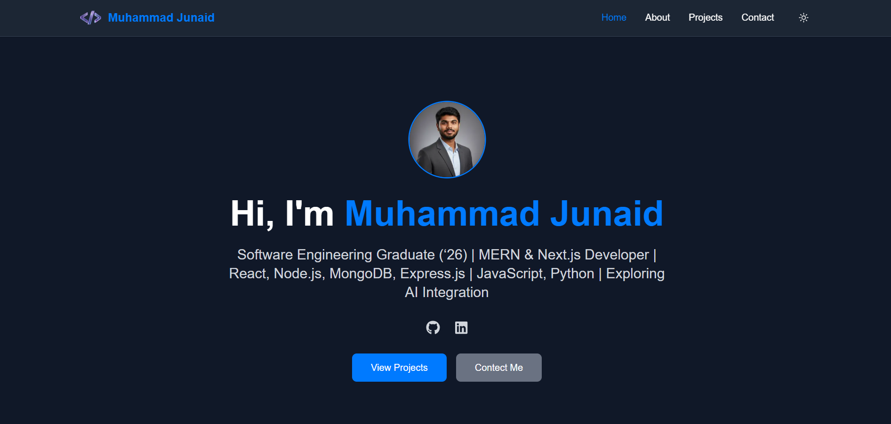
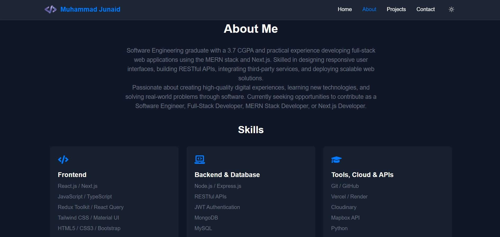
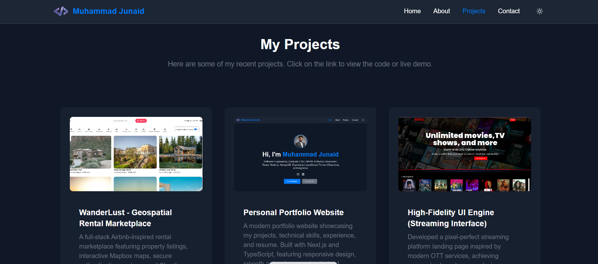
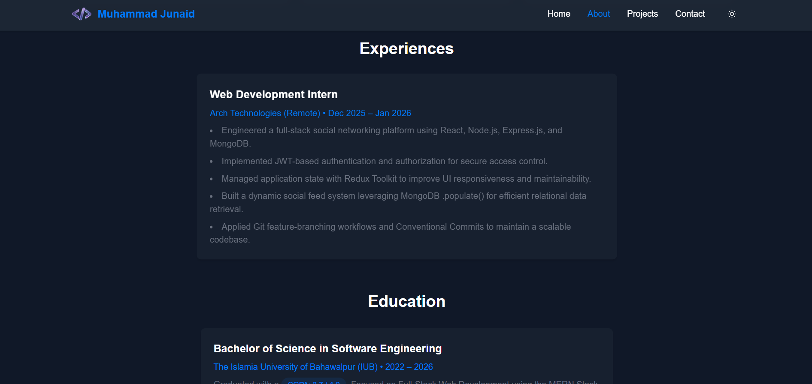
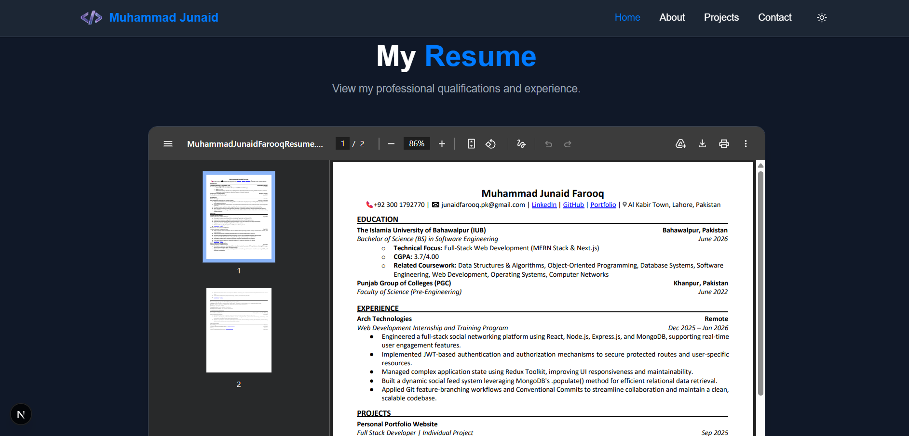
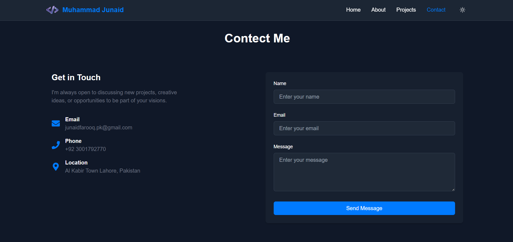

# Muhammad Junaid Farooq | Software Engineer Portfolio


A modern, responsive, and performance-focused developer portfolio built to showcase my software engineering journey, technical expertise, projects, and professional experience.

The portfolio serves as a central hub where recruiters, hiring managers, and fellow developers can explore my work, technical skills, resume, and featured projects.

---

## 🌐 Live Website

### Portfolio

https://muhammadjunaid-swe.vercel.app/

---

## 📸 Screenshots

### Hero Section



### About Section



### Projects Showcase



### Experience Section



### Resume Viewer



### Contact Section



---

## 📊 Project Highlights

* Built using Next.js 16 App Router
* Fully responsive across desktop, tablet, and mobile devices
* Type-safe development with TypeScript
* Smooth UI animations using Framer Motion
* Resume viewing and downloading functionality
* SEO-friendly architecture
* Optimized image delivery and performance
* Modular and reusable component architecture
* Production deployment on Vercel
* Modern UI/UX design principles

---

## 🚀 Portfolio Features

### Professional Branding

* Personal introduction
* Professional summary
* Technical skills showcase
* Resume integration
* Social media links

### Project Showcase

* Featured projects section
* Technology stack highlights
* GitHub repository links
* Live demo links
* Detailed project descriptions

### Interactive User Experience

* Smooth page transitions
* Scroll-based animations
* Responsive layouts
* Interactive UI components

### Resume System

* Embedded PDF viewer
* Resume download support
* Recruiter-friendly presentation

### Contact Experience

* Contact page
* Professional networking links
* Easy communication pathways

---

## 🏗️ Architecture Overview

```text
Visitor
   │
   ▼

Next.js App Router

   │

   ├── Home
   ├── About
   ├── Projects
   ├── Experience
   ├── Resume
   └── Contact

   │
   ▼

Reusable Components

   │
   ▼

Tailwind CSS + Framer Motion

   │
   ▼

Optimized Deployment (Vercel)
```

---

## 📁 Project Structure

```text
src/
├── app/
│   ├── about/
│   ├── contact/
│   ├── projects/
│   ├── api/
│   └── components/
│
├── public/
│   ├── resume.pdf
│   ├── images/
│   └── assets/
│
├── data/
├── lib/
├── styles/
└── utils/
```

---

## ⚙️ Getting Started

### Prerequisites

* Node.js 18+
* npm

### Clone Repository

```bash
git clone https://github.com/muhammadjunaidfarooq/muhammad-junaid-portfolio.git

cd muhammad-junaid-portfolio
```

### Install Dependencies

```bash
npm install
```

### Start Development Server

```bash
npm run dev
```

Visit:

```text
http://localhost:3000
```

---

## 🚀 Production Build

```bash
npm run build
npm start
```

---

## 📈 Future Improvements

* Blog Integration
* Project Filtering
* Analytics Dashboard
* Case Study Pages
* CMS Integration
* Internationalization (i18n)

---

## 📬 Connect With Me

### Muhammad Junaid Farooq

🌐 Portfolio
https://muhammadjunaid-swe.vercel.app/

💼 LinkedIn
https://www.linkedin.com/in/muhammadjunaidfarooq/

🐙 GitHub
https://github.com/muhammadjunaidfarooq

📧 Email
[junaidfarooq.pk@gmail.com](mailto:junaidfarooq.pk@gmail.com)

---

## 📄 License

This project is licensed under the MIT License.

---

## 🤝 Feedback

Feedback, suggestions, and collaboration opportunities are always welcome.

If you would like to discuss software engineering, web development, or potential opportunities, feel free to connect with me through LinkedIn or email.
